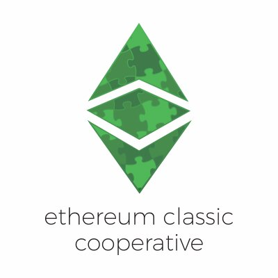

# Ethercluster 

**Design Specifications for Blockchain Infrastructure**

Check out our live site to test a free public RPC built using this guide [here](https://www.ethercluster.com).

---

### Features

* Latest Devops Infrastructure-As-Code tools to build nodes 
* Orchestration with Kubernetes
* Scale Nodes with 1-line commands
* Comes with full guide on deploying Ethereum Classic main and testnets

### New User?

Go checkout the `Getting Started` to begin building your node infrastructure.

Ethercluster is an initiative provided by the [Ethereum Classic Cooperative](https://etccooperative.org/).

