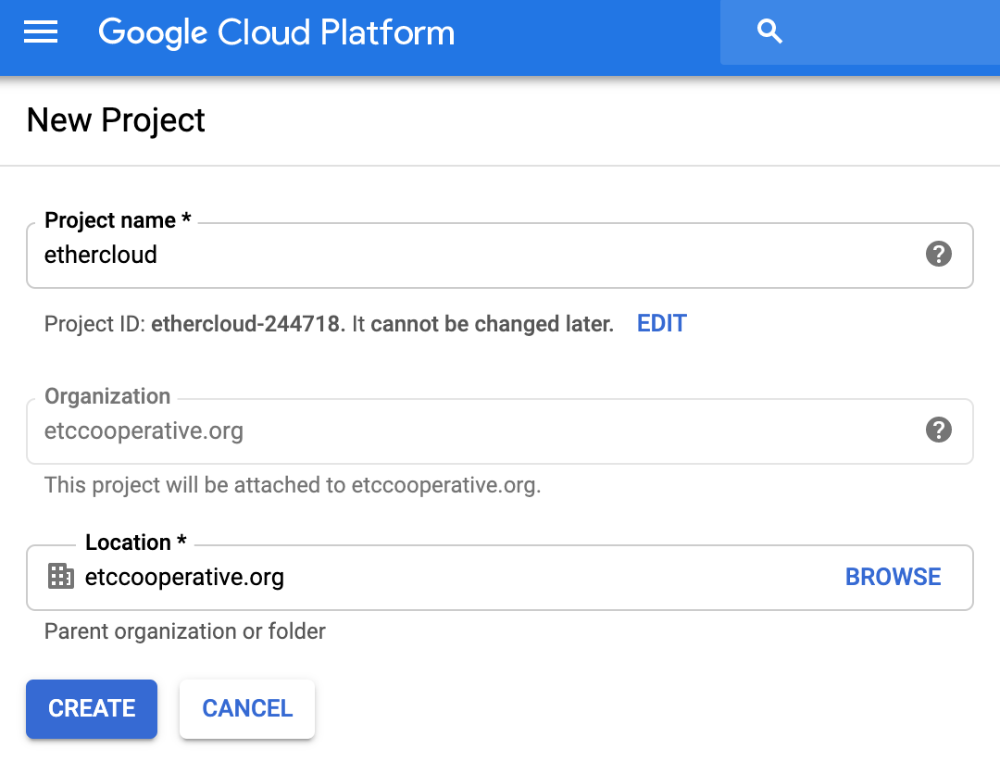
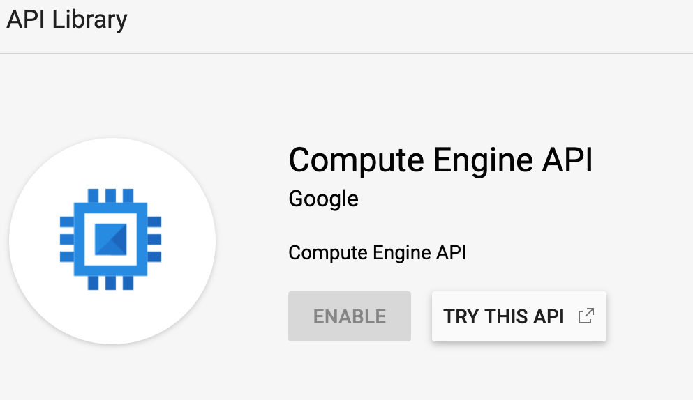

# Cloud Providers

To get started with building your Ethercluster, you'll need to have an account with a Cloud Provider.

A cloud provider basically is the place where you'll host your Ethercluster. Many companies provide
computing power and services that allow you to set up instances in data centers globally where your application
and other infrastructure live. Think of it as the foundation that stores your infrastructure and application.

The following cloud providers you can use are:
* [Google Cloud Platform](https://cloud.google.com/) (GCP)
* [Amazon Web Services](https://aws.amazon.com/) (AWS)
* [Microsoft Azure Cloud](https://azure.microsoft.com/en-us/)
* [Digital Ocean](https://www.digitalocean.com/)

**Note**:
For this version of Ethercluster, we will only be using Google Cloud Platform.
In future versions of this guide, we want to build more High-Availability Ethercluster on multiple cloud servers.
(Think having your nodes on all Amazon, Google and Microsoft servers globally in order to ensure very high upkeep time.)


## Google Cloud Platform

### Account

In order to get started, we will need to get a Google Cloud Platform account.

Go visit [GCP website](https://cloud.google.com) to sign up for an account.

After that, go to the Google Cloud Console and create a project.

As shown here, we will name our project `ethercloud` since it'll be the cloud project that'll host our clusters.



### Billing

After creating your project, you'll need to enable billing. Billing is needed if you are to go forward 
with making your Cluster.

If you're stuck on how to enable billing, checkout the Google Cloud [doc](https://cloud.google.com/billing/docs/how-to/modify-project)


### API

After we setup the project and billing, it's time to enable our API. 

For this guide, we will be enabling our Compute Engine API in order to take advantage of Terraform later instantiating 
our instances via code. More on that later.

You should be able to enable your API following the instructions [here](https://cloud.google.com/endpoints/docs/openapi/enable-api)
and end up in a page like the one below where you can enable it.


Another API we want to enable is the "Cloud Shell API". Look for it the same way you did with Compute Engine API 
in the Marketplace, then enable it.

This will allows us later to SSH into our cluster from our local computer.

### Authentication

We will also need to setup authentication with private keys in order to SSH in the Google Cloud Console from our local terminal.

You can set it up by following this guide [here](https://cloud.google.com/docs/authentication/getting-started) from GCP.

This will generate a JSON for you to download.

You should keep your JSON in a directory path that you can access later. For simplicity and to keep in mind some beginners 
reading this guide, I'll refer to this file as `gcp-auth.json` and have it located on a Unix-based machine on 
the following path: `$HOME/gcp-auth.json` 

After that, open your Terminal on your Mac/Linux and run the following command: 
```sh
export GOOGLE_APPLICATION_CREDENTIALS="$HOME/gcp-auth.json"
```

With this, you're all setup on your Cloud Provider side. Next, we will be checking out Terraform,
the best infra-as-code software to write out your cloud architecture as code.
