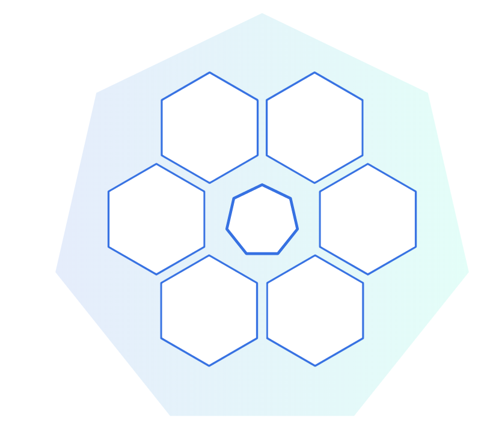
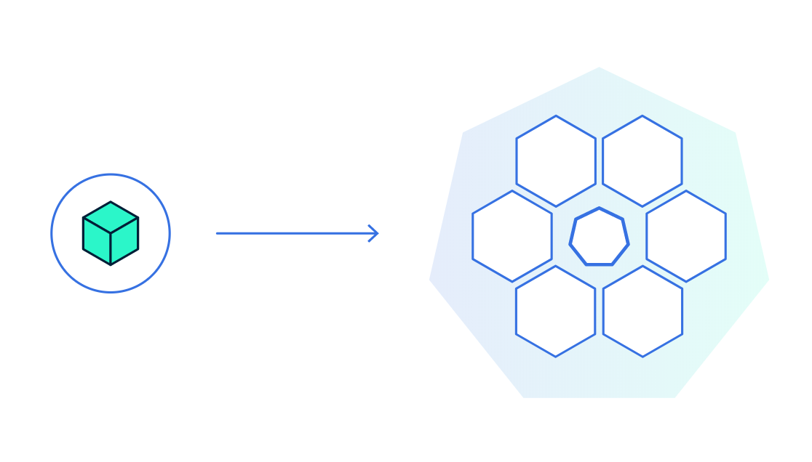
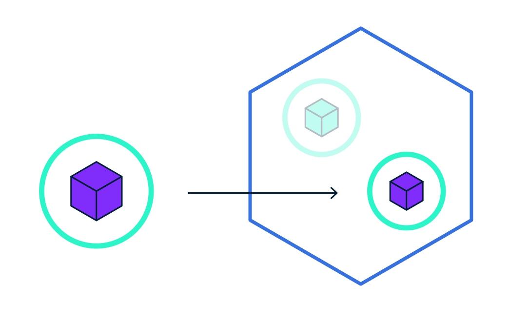
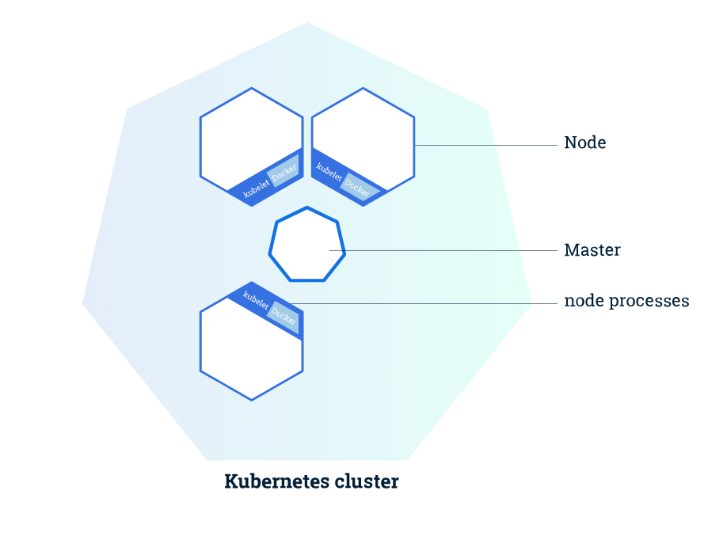
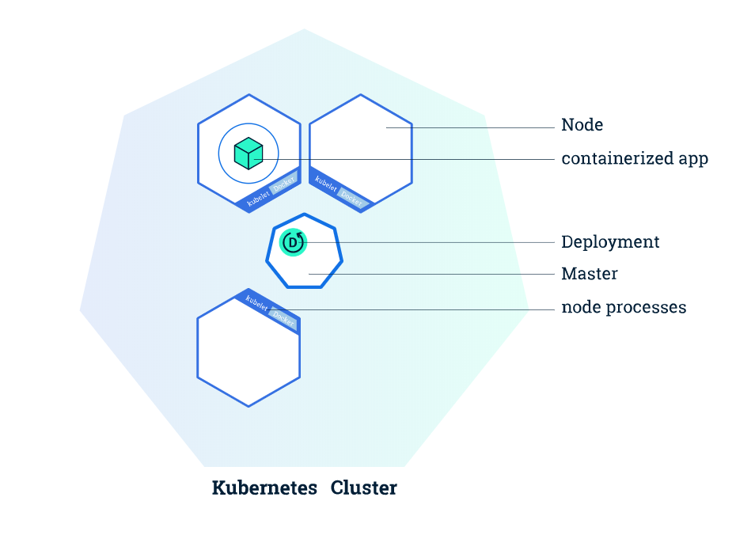
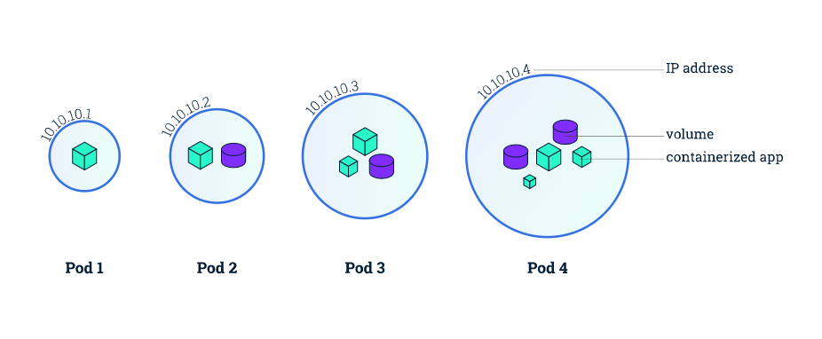
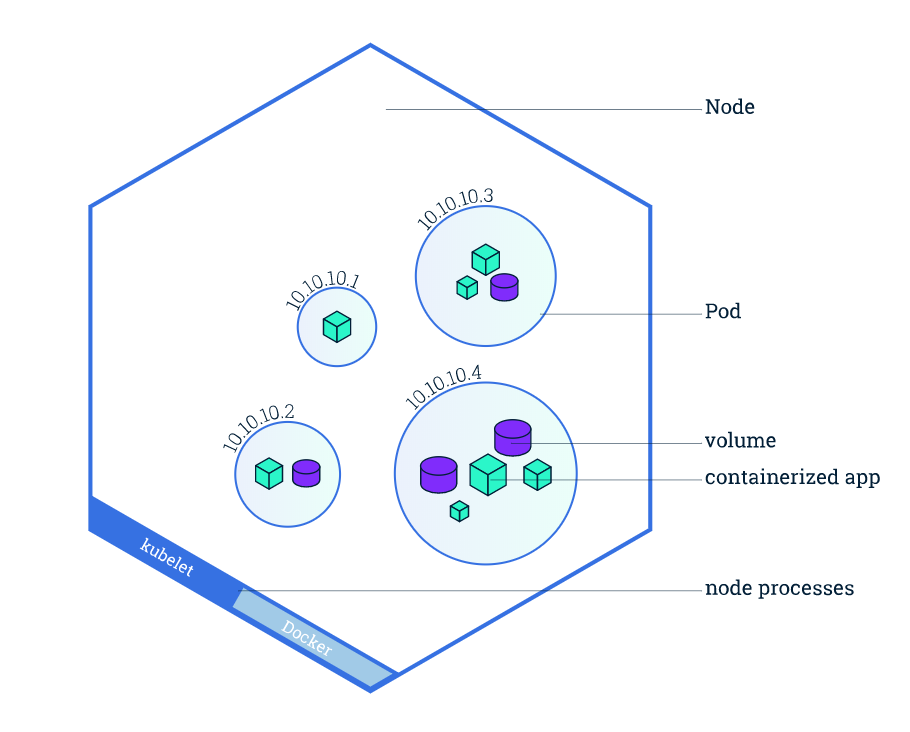

# Kubernetes

Kubernetes is an open-software orchestration, scaling and container deployment tool which we will use
to deploy our ethercluster.

Docker containers are unit of software that packages up code and all its dependencies so the application runs quickly and reliably on any computer. 

This section will very briefly go over Kubernetes, but it won't be very in depth.

In order to learn about Kubernetes, there's a great tutorial [here](https://kubernetes.io/docs/tutorials/kubernetes-basics/).

What we will be doing in this entire guide is describe how we are building our specific cluster and how we design it
with references to external source materials in order to learn more.

## Quick Overview

We know already that containerization (like Docker) helps us package software to allow for deploying new versions of the applications
24/7.

**Note**: If you're not familiar with Docker, there's a great tutorial [here](https://docker-curriculum.com/). We will 
quickly brush over Docker later when going over a container we will be using in Kubernetes.

What Kubernetes enables us to do is make sure those containerized applications we are deploying are running where and when we 
want them to and give them the tools they need to work easily.

Essentially, the idea is to first create a cluster (images shown below taken from Kubernetes tutorial above for demonstration).

This is essentially what we did in the previous section with Terraform and GKE, instantiating our node pools for our cluster.

Next, we deploy our containerized app to the cluster as shown below.

This is what we will be doing next.

We can also scale our containerized app on Kubernetes by having more of it running.

## Kubernetes Cluster

Kubernetes both creates a highly-available cluster of computers connected together and automates distribution of containerized 
applications in an efficient way.

From a high level, a Kubernetes cluster consists of two things:
1) Master
2) Node

A figure is shown below:

The master is essentially in charge of managing the cluster and the nodes, including scheduling applications, scaling 
and rolling out new updates.

A node is basically a VM or physical computer serving as a worker for the master in a cluster. There's a kubelet on each 
node used for communicating with the master.

## Kubernetes Components

### Deployments

**Deployments** are configurations you set up to deploy and application, which instructs Kubernetes how to create and update your app.
Kubernetes master configures and deploys application to individual nodes on the cluster. In the case of Node failure or going offline, 
Master can redeploy the application on an instance at an available node, assuring a self-healing process for the cluster.

### Pods

When you create a Deployment, Kubernetes creates a **Pod** to host your containerized application. Pods are abstractions by Kubernetes
that host one or more application containers as well as shared resources between them such as shared storage (**Volumes**), 
networking and unique cluster IPs (**Services**), and instructions on how to run it (container versions and ports to use).

### Nodes

Pods always run on Nodes. Each Node comes with **Kubelet**, a process for communication between the node and master, 
as well as a container system like **Docker**.

### Services

A Service in Kubernetes is an abstraction that defines a policy by which your Pods can be accessed, allowing them to receive traffic.

Several different types of Services exist in Kubernetes:
* ClusterIP: Pod only accessed from within the Cluster
* NodePort: Exposing the service on the same port of each selected Node in the cluster using NAT.
* LoadBalancer: Creates external LoadBalancer in the cloud and assigns a fixed external IP to the service.

Now, with a general overview of essential components of Kubernetes, we will start building our Ethercluster in the next section. 
