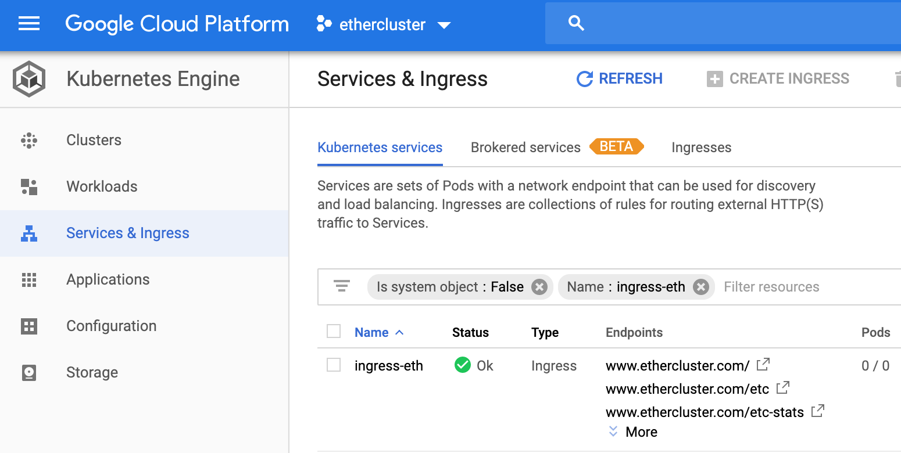
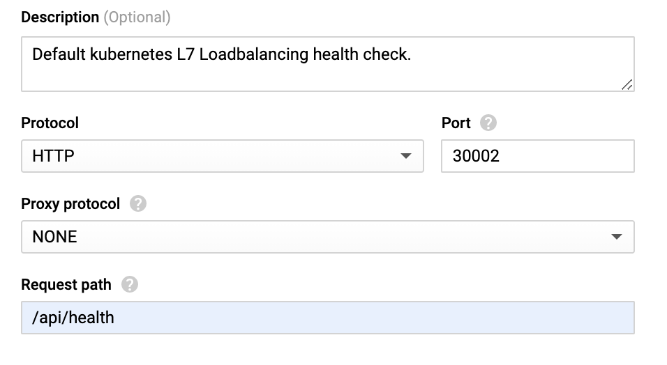

# SSL Configuration

In order to get started with SSL configuration, we need a few things first.

We will need to have the following:
* Domain name
* SSL certificate for the domain name

I have linked the following [guide](https://www.namecheap.com/support/knowledgebase/article.aspx/804/69/ssl-certificate-activation-and-installation-for-domains-hosted-on-namecheap-hosting-servers) I used for https://www.ethercluster.com.

What it should return back to you after Namecheap registers your SSL for you is the following:
* SSL Key `.key`
* SSL Certificate `.crt`

**NOTE** This step isn't necessary to have a running cluster, the previous sections are sufficient.
This is only useful if you want to expose your RPC publicly to others to use it.

## Secrets

Now that we have our `domain-com.key` and `domain-com.crt`, we can create a Kubernetes secret for them so we can securely store it.

If we assume we have both files in a directory called `config`, we can run the following command to instantiate them:
```sh
kubectl tls tls-classic --key ./config/domain-com.key --cert ./config/domain-com.crt --namespace ethercluster 
```

This will create your Kubernetes secret which will help you in the next step, Ingress.

## Ingress

[Ingress](https://kubernetes.io/docs/concepts/services-networking/ingress/) allows us to route to different services to the 
outside via HTTP and HTTPS, as well as allow us to terminate TCP/SSL.

We will need to create the ingress manifest file then instantiate it. After that, we need to configure the Health Checks 
in Google Cloud. 

```sh
vim ingress.yml
```

Inside the file, let's add the following:
```yml
apiVersion: extensions/v1beta1
kind: Ingress
metadata:
    name: ingress-ethercluster
    namespace: ethercluster
    annotations:
        kubernetes.io/ingress.global-static-ip-name: ethercluster-address
        kubernetes.io/ingress.allow-http: "false"
        kubernetes.io/ingress.class: "gce"
spec:
    tls:
      - hosts:
        - www.domain.com
        secretName: tls-classic
    backend:
      serviceName: classic 
      servicePort: 8545
    rules:
    - host: www.domain.com
      http:
        paths:
        - path: /
          backend:
            serviceName: classic
            servicePort: 8545
```

This specifies we are creating an ingress that points to `ethercluster-address` (the static IP we created in Terraform section).

It also assigns the host to the domain.com we added and provides the secretName as `tls-classic` as we created before.
It wires to the backend to the serviceName `classic` at port 8545.

Let's instantiate it with:
```
kubectl apply -f ingress.yml
```

You can monitor it's progression with:
```
kubectl describe ingress ingress-ethercluster -n ethercluster
```

While you monitor it, you need to head over to Google Cloud to set up the Health Checks. Reason is, it won't be exposed publicly
if the health checks aren't passed on Google Cloud, and they're not yet sure how to check the health status of Parity.

We do that by going over to Google Cloud, and then to Kubernetes Engine section on the left, and then click on Services 
as shown below:


We click on the Ingress we created earlier here, and then try to determine the port number for your classic service.
It's the port number assigned by Kubernetes. You can find it by running the following:
```sh
kubectl get service classic -n ethercluster
```

It'll return what we saw earlier:
```sh
NAME                        TYPE           CLUSTER-IP      EXTERNAL-IP       PORT(S)                                       AGE
service/classic             LoadBalancer   10.00.00.00   <pending>      8080:30003/TCP,8545:30002/TCP,443:30001/TCP   1m
```

If you notice under `PORT(S)`, you'll see the port `8545:30002`. The 30002 is the one assigned by Kubernetes for the abstracted 8545.
That's the port you'll need to look for under the Ingress section, as shown below:


Click on the appropriate one, which will lead you to its page. 

Scroll down until you find the health check section. It has a link under it that you must click as well.

Now, you're taken to the Health Check page.

It checks Parity's 8545 port at actual port 30002. But it does the health check on this endpoint `/`
Parity health checks happen at `/api/health`.

Configure it accordingly as shown below, then save it.


Now, wait about 10-15 minutes for the health checks to pass. You should be able to now use your RPC endpoint over SSL.

If you have any issues, you can always use `kubectl describe` to debug your ingress.


I hope you enjoyed this guide and the cool tools given to us by the Cloud, Kubernetes and Terraform.
